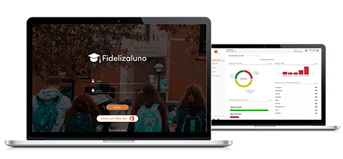
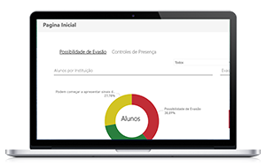
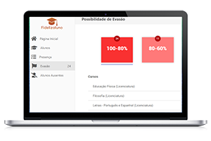
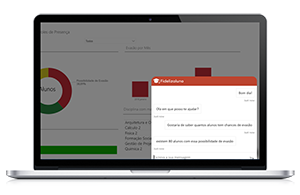
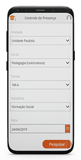
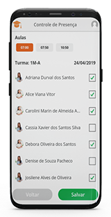
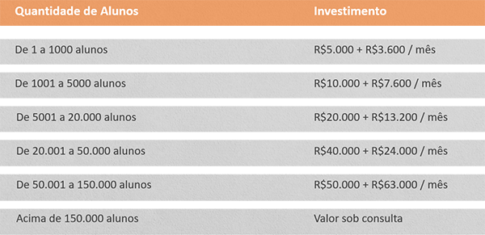

# Fidelizaluno
> Vem saber um pouco mais sobre a solução que pode revolucionar o setor de educação no Brasil.

A educação pode ser considerada crucial para a construção e evolução social. É apostando nisso que nós, da FC Nuvem, queremos olhar para cada aluno como ser único, priorizando o ensino e oferecendo um cenário melhor propenso a evitar um dos problemas mais assoladores dos últimos anos: a evasão de alunos.

A evasão pode causar diversos efeitos colaterais numa instituição de ensino, como diminuição drástica de receita, principalmente devido ao desperdício de recursos, provocando como consequência um impacto na qualidade de ensino fazendo com que a instituição sofra uma perda considerável de estabilidade e relevância num cenário geral.

E são vários os fatores que podem incentivar que um aluno deixe de frequentar a escola, como: acesso limitado as instituições, condição financeira comprometida, envolvimento com atividades ilegais, falta de acessibilidade no caso de pessoas com necessidades especiais, introdução precoce no mercado de trabalho ou até mesmo o acontecimento de uma gravidez no período dos estudos. 

Uma das maneiras de evitar a evasão é identificando a possibilidade de ocorrência e trabalhando de forma preditiva com ações de acordo com o motivo. É o que o Fidelizaluno traz com assertividade e eficiência.

Visando a retenção de alunos baseada na predição de padrões aprendidos por inteligência artificial, que analisa os dados de seus alunos para obter a probabilidade de abandono de seus cursos, de acordo com as variáveis definidas pela instituição. A partir desta análise, é possível entender o indivíduo e quais os motivos que o levariam à evasão. Com os dados compilados, o Fidelizaluno envia para as áreas responsáveis os motivos da possível evasão e indica os protocolos, que devem ser tomados, ao setor responsável. A solução proporciona diversos recursos para que o trabalho seja efetivo dentro da instituição. Afinal, não basta informar a possibilidade de evasão, é importante que o gestor entenda o cenário de forma clara e objetiva para, além de visualizar quais alunos estão formando grupos de risco, possa identificar a raiz do problema e trabalhe para solucionar de forma eficiente o que realmente cria esse quadro dentro da instituição.

 

Além do acesso à diversas funcionalidades na versão para desktop, os professores podem contar com um aplicativo de controle de presença que alimentará o sistema de forma automática. Outra forma que o Fidelizaluno permite, é o controle de presença feito por reconhecimento facial, podendo, inclusive fazer a análise se comportamento e emoções dos alunos, criando dados mais precisos de motivos de evasão.

  

## Conheça o investimento

## Fale com nosso time

**Telefone** (11) 3158-1049
**Email** contato@fcnuvem.com.br
**Visite nosso site:** [FC Nuvem](https://www.fcnuvem.com.br/)
